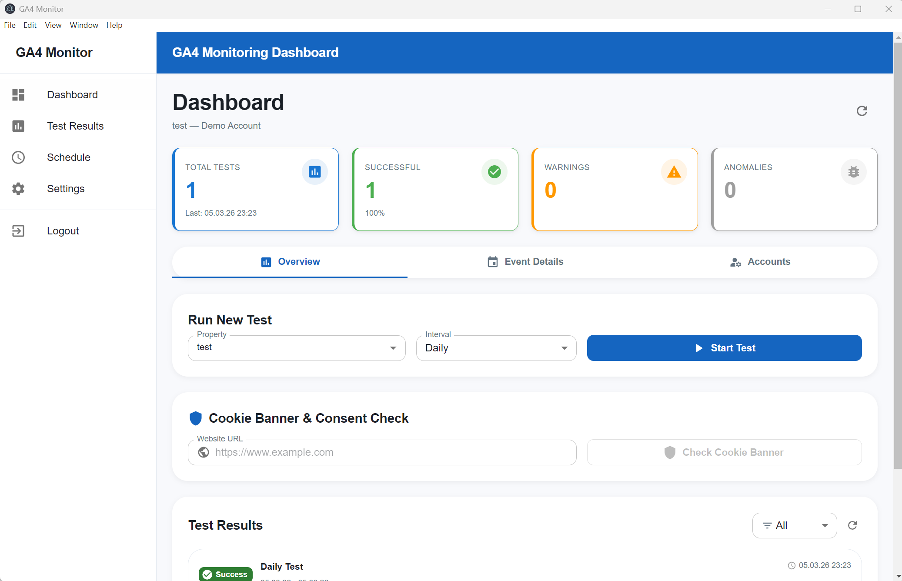
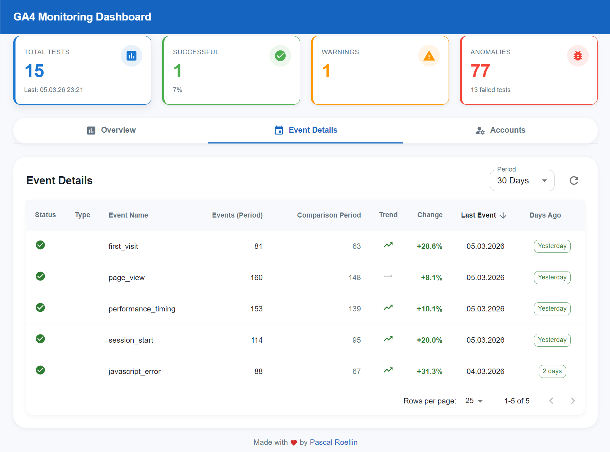

# GA4 Monitor Desktop Application

Automated testing and monitoring for Google Analytics 4 properties.

## Features

- **Automated GA4 Testing**: Run tests for daily, weekly, monthly, and quarterly intervals
- **Anomaly Detection**: Identifies unusual event patterns and missing events
- **Cookie Banner & Consent Mode Check**: Verify GDPR compliance and Google Consent Mode setup
- **Multi-Account Support**: Manage multiple Google Analytics accounts
- **Event Monitoring**: Track all GA4 events with detailed analytics

## Screenshots

<div align="center">
  
  
</div>

## Requirements

- **Node.js**: v18.0.0 or higher
- **npm**: v9.0.0 or higher
- **Google Cloud Project** with Google Analytics Data API enabled
- **OAuth 2.0 Credentials** (Client ID and Client Secret)

## Installation

### Step 1: Clone the Repository

```bash
git clone https://github.com/Menaxerius/ga4-monitor.git
cd ga4-monitor
```

### Step 2: Install Dependencies

```bash
npm install
```

### Step 3: Create Google Cloud Project & OAuth Credentials

1. Go to [Google Cloud Console](https://console.cloud.google.com/)
2. Create a new project or select an existing one
3. Enable the **Google Analytics Data API**:
   - Navigate to **APIs & Services** → **Library**
   - Search for "Google Analytics Data API"
   - Click **Enable**
4. Create OAuth 2.0 credentials:
   - Navigate to **APIs & Services** → **Credentials**
   - Click **+ CREATE CREDENTIALS** → **OAuth client ID**
   - Application type: **Desktop app**
   - Name: `GA4 Monitor`
   - Click **Create**
5. Copy your **Client ID** and **Client Secret**

### Step 4: Configure Environment Variables

1. Copy the example environment file:
```bash
cp .env.example .env
```

2. Edit `.env` and add your credentials:
```env
GOOGLE_CLIENT_ID=your_client_id_here.apps.googleusercontent.com
GOOGLE_CLIENT_SECRET=your_client_secret_here
GOOGLE_REDIRECT_URI=http://localhost:3000
```

### Step 5: Build the Application

```bash
npm run build
```

## Running the Application

### Development Mode

```bash
npm run start
```

### Production Mode

First build the application:
```bash
npm run build
```

Then run:
```bash
npm run start:prod
```

## Usage

### 1. Login to Google

On first launch, you'll be redirected to Google's OAuth page. Log in with your Google account that has access to GA4 properties.

### 2. Select a Property

Choose a GA4 property from the dropdown to monitor.

### 3. Run a Test

- Select an interval (Daily, Weekly, Monthly, Quarterly)
- Click "Start Test"
- View results in the Test Results section

### 4. Check Cookie Banner & Consent Mode

- Enter your website URL
- Click "Check Cookie Banner"
- Review the consent mode setup and compliance status

## Project Structure

```
ga4-monitor/
├── src/
│   ├── main/           # Electron main process
│   ├── renderer/       # React UI
│   ├── preload/        # Preload scripts
│   └── shared/         # Shared types and utilities
├── data/               # Local database (auto-created)
├── dist/               # Compiled output
├── package.json
├── vite.config.mts
└── tsconfig.json
```

## Troubleshooting

### Port 3000 already in use

```bash
# Kill process on port 3000 (Windows)
npx kill-port 3000

# Or stop the application
npm run stop
```

### Authentication failed

- Verify your OAuth credentials are correct
- Ensure Google Analytics Data API is enabled
- Check that your Google account has access to GA4 properties

### No GA4 properties found

- Ensure you have GA4 properties (not Universal Analytics)
- Check your account permissions in Google Analytics

## Security Notice

**Never commit your `.env` file or any credentials to version control.**

The `.gitignore` file is configured to exclude:
- `.env`
- `data/` (local database)
- `dist/` (compiled output)
- `node_modules/`

## Contributing

1. Fork the repository
2. Create a feature branch (`git checkout -b feature/amazing-feature`)
3. Commit your changes (`git commit -m 'Add amazing feature'`)
4. Push to the branch (`git push origin feature/amazing-feature`)
5. Open a Pull Request

## License

This project is licensed under the **Mozilla Public License 2.0 (MPL-2.0)**.

**Free for commercial use with attribution. The footer credit to Pascal Roellin must remain intact.**

See [LICENSE.md](LICENSE.md) for the full license text.

## Support

For issues and questions:
- Open an issue on GitHub
- Check existing issues for solutions

## Changelog

### Version 1.0.0
- Initial release
- Automated GA4 testing
- Cookie banner detection
- Consent Mode verification
- Multi-account support
